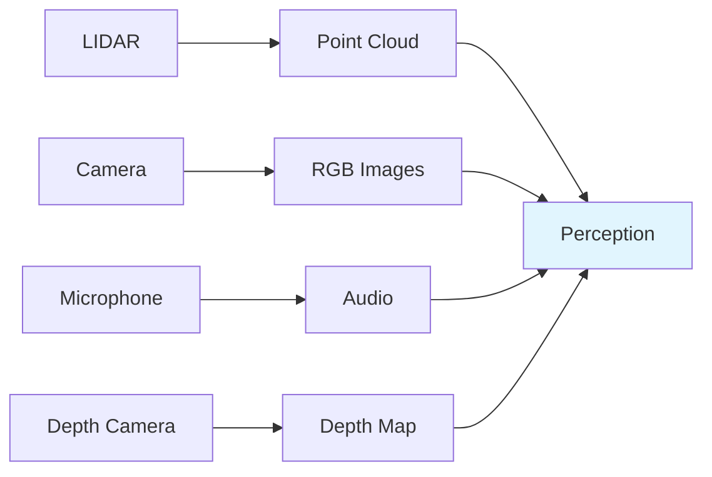
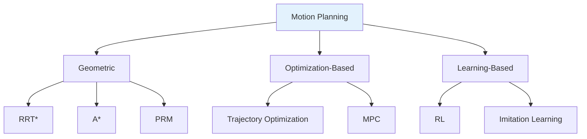

# Chapter 1: Physical AI Foundations

This chapter introduces the fundamental concepts of Physical AI - the intersection of artificial intelligence and physical robotics. You'll learn about sensors, actuators, state estimation, and motion planning.

## 1.1 What is Embodied Intelligence?

**Embodied intelligence** refers to AI systems that have a physical body and interact with the real world. Unlike chatbots or image classifiers, embodied AI must:

- **Perceive** the world through sensors
- **Reason** about physical actions and consequences
- **Act** on the world through actuators
- **Learn** from physical interactions

### Why is Physical AI Hard?

| Challenge | Description |
|-----------|-------------|
| **Sensor Noise** | Real-world sensors are imperfect and noisy |
| **Partial Observability** | You can't see everything at once |
| **Physics Constraints** | Robots must obey laws of physics |
| **Real-Time Requirements** | Decisions must be made quickly |
| **Safety** | Mistakes can cause damage or injury |

## 1.2 Sensors and Perception

Sensors are the robot's window to the world. Let's explore common sensors used in humanoid robotics.

### Vision Sensors

```python
# Camera sensor configuration example
import numpy as np

class CameraSensor:
    def __init__(self, resolution=(1920, 1080), fps=30):
        self.resolution = resolution
        self.fps = fps
        self.fov = 90  # Field of view in degrees

    def capture_frame(self):
        """Capture a single frame from the camera."""
        # In a real robot, this would interface with hardware
        frame = np.random.randint(0, 255, (*self.resolution, 3), dtype=np.uint8)
        return frame

    def get_depth_map(self):
        """Get depth information (if depth camera available)."""
        # Simulated depth map
        depth = np.random.random(self.resolution) * 10  # meters
        return depth
```

### Proprioceptive Sensors

These sensors tell the robot about its own state:

| Sensor Type | Measures | Example Use |
|-------------|----------|-------------|
| **IMU** | Acceleration, angular velocity | Balance, orientation |
| **Encoders** | Joint position, velocity | Precise motor control |
| **Force Sensors** | Contact force, torque | Grasping, walking |
| **Current Sensors** | Motor current | Detecting obstacles/stalls |

### Exteroceptive Sensors

These sensors tell the robot about the external world:



## 1.3 Actuators and Control

Actuators are the "muscles" of a robot - they convert energy into motion.

### Types of Actuators

#### Electric Motors (DC/BLDC)

Most common in humanoid robots due to:
- High power-to-weight ratio
- Precise control
- Clean operation

```python
class DCMotor:
    def __init__(self, max_torque, max_speed):
        self.max_torque = max_torque  # Nm
        self.max_speed = max_speed    # rad/s
        self.current_torque = 0

    def set_torque(self, torque):
        """Set motor torque (clamped to max)."""
        self.current_torque = np.clip(torque, -self.max_torque, self.max_torque)

    def get_velocity(self, load):
        """Get velocity given load (simplified model)."""
        available_torque = self.max_torque - abs(load)
        ratio = self.current_torque / self.max_torque
        return self.max_speed * ratio
```

#### Hydraulic Actuators

- Very high force output
- Used in Boston Dynamics robots
- Complex maintenance

#### Pneumatic Actuators

- Clean and lightweight
- Limited force output
- Compliant by nature

### Control Theory Basics

#### PID Control

The most common control algorithm in robotics:

```python
class PIDController:
    def __init__(self, kp, ki, kd, setpoint=0):
        self.kp = kp  # Proportional gain
        self.ki = ki  # Integral gain
        self.kd = kd  # Derivative gain
        self.setpoint = setpoint

        self.integral = 0
        self.previous_error = 0

    def update(self, measurement, dt):
        """Update controller and return output."""
        error = self.setpoint - measurement

        # Proportional term
        p_term = self.kp * error

        # Integral term
        self.integral += error * dt
        i_term = self.ki * self.integral

        # Derivative term
        derivative = (error - self.previous_error) / dt
        d_term = self.kd * derivative

        self.previous_error = error

        return p_term + i_term + d_term

# Example: Control a joint position
pid = PIDController(kp=100, ki=0.1, kd=10, setpoint=1.57)  # 90 degrees

# Control loop
dt = 0.01  # 100 Hz
for i in range(100):
    current_angle = get_joint_angle()  # Would read from encoder
    torque = pid.update(current_angle, dt)
    set_motor_torque(torque)
```

## 1.4 State Estimation

State estimation is the process of determining the robot's internal state from sensor measurements.

### Why is State Estimation Necessary?

1. **Sensors are noisy** - Direct measurements have errors
2. **Not everything is measurable** - Some states must be inferred
3. **Prediction** - Need to estimate future states for planning

### Kalman Filter

The Kalman Filter is the foundational algorithm for state estimation:

```python
import numpy as np

class KalmanFilter:
    def __init__(self, F, H, Q, R, x0, P0):
        # State transition matrix
        self.F = F
        # Observation matrix
        self.H = H
        # Process noise covariance
        self.Q = Q
        # Measurement noise covariance
        self.R = R
        # Initial state estimate
        self.x = x0
        # Initial covariance estimate
        self.P = P0

    def predict(self):
        """Predict next state."""
        self.x = self.F @ self.x
        self.P = self.F @ self.P @ self.F.T + self.Q
        return self.x

    def update(self, z):
        """Update with measurement z."""
        # Measurement residual
        y = z - self.H @ self.x
        # Residual covariance
        S = self.H @ self.P @ self.H.T + self.R
        # Kalman gain
        K = self.P @ self.H.T @ np.linalg.inv(S)
        # Update state
        self.x = self.x + K @ y
        # Update covariance
        I = np.eye(self.P.shape[0])
        self.P = (I - K @ self.H) @ self.P
        return self.x

# Example: Track position with noisy GPS
dt = 1.0
F = np.array([[1, dt], [0, 1]])  # State transition
H = np.array([[1, 0]])             # Observe position only
Q = np.eye(2) * 0.1                # Process noise
R = np.eye(1) * 5                  # Measurement noise
x0 = np.array([0, 0])              # Start at origin
P0 = np.eye(2) * 10                # High initial uncertainty

kf = KalmanFilter(F, H, Q, R, x0, P0)
```

## 1.5 Motion Planning

Motion planning is the problem of finding a sequence of actions to achieve a goal.

### Planning Taxonomy



### RRT* (Rapidly-exploring Random Tree Star)

A popular sampling-based planner:

```python
import random
import math

class Node:
    def __init__(self, x, y):
        self.x = x
        self.y = y
        self.parent = None
        self.cost = 0

def distance(n1, n2):
    return math.sqrt((n1.x - n2.x)**2 + (n1.y - n2.y)**2)

def rrt_star(start, goal, obstacles, max_iter=1000, step_size=1.0):
    """RRT* path planning algorithm."""
    nodes = [Node(*start)]

    for i in range(max_iter):
        # 1. Sample random point
        if random.random() < 0.1:  # 10% chance to sample goal
            x_rand = goal
        else:
            x_rand = (random.uniform(-10, 10), random.uniform(-10, 10))

        # 2. Find nearest node
        x_nearest = min(nodes, key=lambda n: distance(n, Node(*x_rand)))

        # 3. Steer towards random point
        theta = math.atan2(x_rand[1] - x_nearest.y, x_rand[0] - x_nearest.x)
        x_new = (
            x_nearest.x + step_size * math.cos(theta),
            x_nearest.y + step_size * math.sin(theta)
        )

        # 4. Check collision
        if collides(x_nearest, Node(*x_new), obstacles):
            continue

        x_new_node = Node(*x_new)

        # 5. Find best parent (RRT* improvement)
        near_nodes = [n for n in nodes if distance(n, x_new_node) < step_size * 2]
        if near_nodes:
            x_min = min(near_nodes, key=lambda n: n.cost + distance(n, x_new_node))
            x_new_node.parent = x_min
            x_new_node.cost = x_min.cost + distance(x_min, x_new_node)

            # 6. Rewire
            for n in near_nodes:
                if x_new_node.cost + distance(x_new_node, n) < n.cost:
                    n.parent = x_new_node
                    n.cost = x_new_node.cost + distance(x_new_node, n)

        nodes.append(x_new_node)

        # Check if goal reached
        if distance(x_new_node, Node(*goal)) < step_size:
            return extract_path(x_new_node)

    return None  # No path found

def collides(n1, n2, obstacles):
    """Simple collision check."""
    for obs in obstacles:
        # Check if line segment intersects obstacle
        if line_intersects_circle((n1.x, n1.y), (n2.x, n2.y), obs):
            return True
    return False

def extract_path(node):
    """Extract path from goal to start."""
    path = []
    while node:
        path.append((node.x, node.y))
        node = node.parent
    return list(reversed(path))
```

## Summary

In this chapter, you learned:

- **Physical AI** combines perception, reasoning, and action in the physical world
- **Sensors** provide noisy, partial observations of the world
- **Actuators** convert energy into motion through motors, hydraulics, or pneumatics
- **PID Control** is the foundation of robot control
- **Kalman Filters** estimate state from noisy measurements
- **Motion Planning** finds valid paths through configuration space

## Next Steps

Continue to **[Chapter 2: ROS 2](./chapter-02-ros2.md)** to learn how to build complex robotic systems using the Robot Operating System.

## Review Questions

1. Why is embodied AI more difficult than purely digital AI?
2. What are the three terms in a PID controller, and what does each do?
3. How does a Kalman Filter combine prediction and measurement?
4. What makes RRT* better than the original RRT algorithm?
