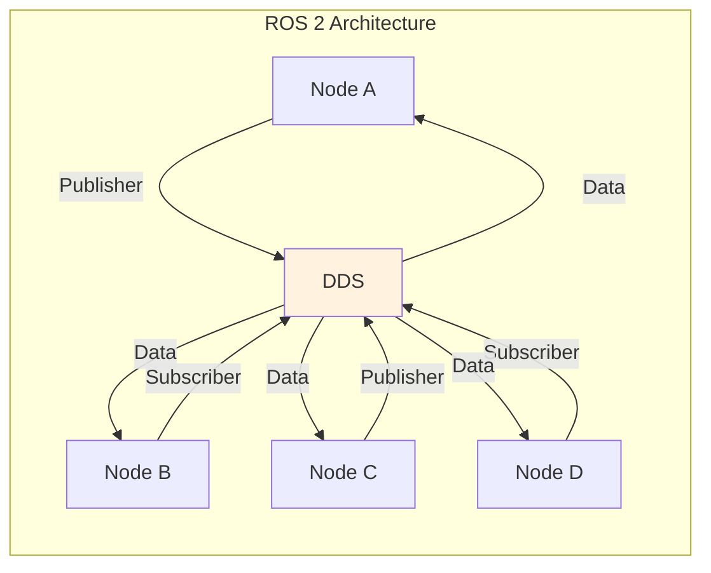
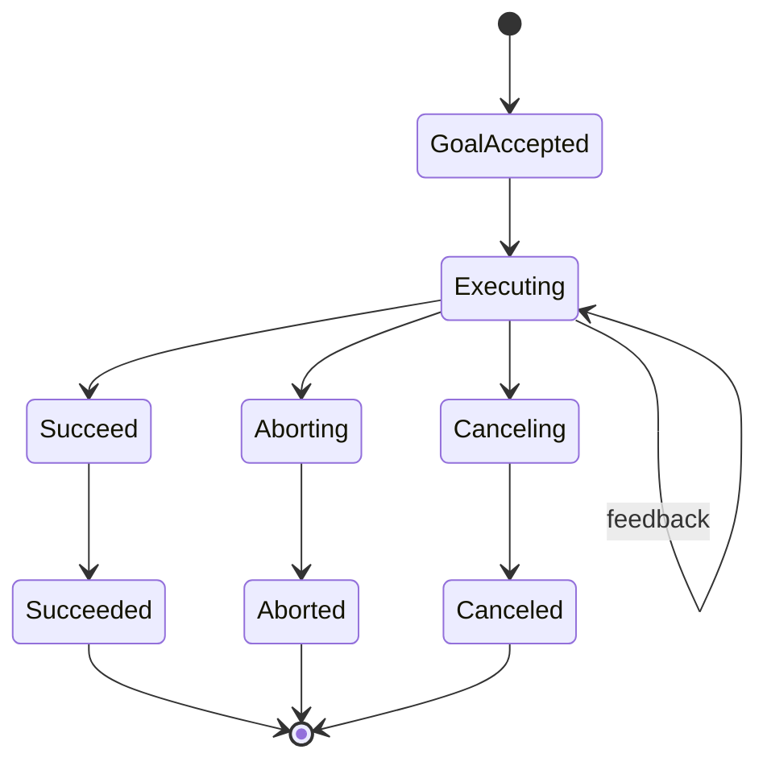

# Chapter 2: ROS 2 - Robot Operating System

This chapter covers ROS 2 (Robot Operating System 2), the middleware framework used for building complex robotic applications.

## 2.1 What is ROS 2?

ROS 2 is a set of software libraries and tools for building robot applications. It provides:

- **Communication** between different processes
- **Hardware abstraction** for sensors and actuators
- **Message passing** for data exchange
- **Package management** for code organization
- **Tools** for visualization and debugging

### ROS 1 vs ROS 2

| Feature | ROS 1 | ROS 2 |
|---------|-------|-------|
| **Real-time** | No | Yes (DDS) |
| **Security** | No | Yes |
| **Multi-robot** | Difficult | Native support |
| **Platforms** | Linux only | Linux, Windows, macOS, RTOS |
| **Transport** | TCP/UDP | DDS (Data Distribution Service) |



## 2.2 ROS 2 Core Concepts

### Nodes

A node is a process that performs computation. ROS 2 is a distributed system of nodes.

```python
# my_first_node.py
import rclpy
from rclpy.node import Node

class MyFirstNode(Node):
    def __init__(self):
        super().__init__('my_first_node')
        self.get_logger().info('Hello, ROS 2!')

def main(args=None):
    rclpy.init(args=args)
    node = MyFirstNode()
    rclpy.spin(node)
    node.destroy_node()
    rclpy.shutdown()

if __name__ == '__main__':
    main()
```

### Topics

Topics are named buses over which nodes exchange messages.

**Publishers** send messages, **Subscribers** receive messages.

```python
# publisher_node.py
import rclpy
from rclpy.node import Node
from std_msgs.msg import String

class PublisherNode(Node):
    def __init__(self):
        super().__init__('publisher_node')
        self.publisher_ = self.create_publisher(String, 'chatter', 10)
        self.timer = self.create_timer(1.0, self.timer_callback)
        self.count = 0

    def timer_callback(self):
        msg = String()
        msg.data = f'Hello, world! {self.count}'
        self.publisher_.publish(msg)
        self.get_logger().info(f'Publishing: "{msg.data}"')
        self.count += 1

def main(args=None):
    rclpy.init(args=args)
    node = PublisherNode()
    rclpy.spin(node)
    node.destroy_node()
    rclpy.shutdown()
```

```python
# subscriber_node.py
import rclpy
from rclpy.node import Node
from std_msgs.msg import String

class SubscriberNode(Node):
    def __init__(self):
        super().__init__('subscriber_node')
        self.subscription = self.create_subscription(
            String,
            'chatter',
            self.listener_callback,
            10
        )

    def listener_callback(self, msg):
        self.get_logger().info(f'I heard: "{msg.data}"')

def main(args=None):
    rclpy.init(args=args)
    node = SubscriberNode()
    rclpy.spin(node)
    node.destroy_node()
    rclpy.shutdown()
```

### Services

Services provide request/response communication, like a function call.

```python
# service_server.py
from example_interfaces.srv import AddTwoInts

class ServiceServer(Node):
    def __init__(self):
        super().__init__('add_two_ints_server')
        self.srv = self.create_service(
            AddTwoInts,
            'add_two_ints',
            self.add_two_ints_callback
        )

    def add_two_ints_callback(self, request, response):
        response.sum = request.a + request.b
        self.get_logger().info(
            f'Incoming request\na: {request.a} b: {request.b}'
        )
        return response
```

### Actions

Actions are for long-running tasks with feedback.



## 2.3 TF (Transform Library)

TF maintains the relationship between coordinate frames over time.

```python
# tf_broadcaster.py
from rclpy.node import Node
from geometry_msgs.msg import TransformStamped
from tf2_ros import TransformBroadcaster

class FramePublisher(Node):
    def __init__(self):
        super().__init__('tf_broadcaster')
        self.tf_broadcaster = TransformBroadcaster(self)
        self.timer = self.create_timer(0.1, self.broadcast_timer_callback)
        self.angle = 0.0

    def broadcast_timer_callback(self):
        t = TransformStamped()
        t.header.stamp = self.get_clock().now().to_msg()
        t.header.frame_id = 'base_link'
        t.child_frame_id = 'camera_link'

        # Rotate camera around Z axis
        self.angle += 0.01
        t.transform.translation.x = 0.1
        t.transform.translation.y = 0.0
        t.transform.translation.z = 0.5

        q = quaternion_from_euler(0, 0, self.angle)
        t.transform.rotation.x = q[0]
        t.transform.rotation.y = q[1]
        t.transform.rotation.z = q[2]
        t.transform.rotation.w = q[3]

        self.tf_broadcaster.sendTransform(t)
```

## 2.4 URDF (Unified Robot Description Format)

URDF is XML format for describing robot geometry.

```xml
<?xml version="1.0"?>
<robot name="my_robot">
  <link name="base_link">
    <visual>
      <geometry>
        <cylinder length="0.6" radius="0.2"/>
      </geometry>
      <origin rpy="0 0 0" xyz="0 0 0.3"/>
    </visual>
  </link>

  <joint name="base_to_torso" type="fixed">
    <parent link="base_link"/>
    <child link="torso_link"/>
    <origin xyz="0 0 0.6"/>
  </joint>

  <link name="torso_link">
    <visual>
      <geometry>
        <box size="0.4 0.3 0.6"/>
      </geometry>
    </visual>
  </link>

  <joint name="torso_to_head" type="revolute">
    <parent link="torso_link"/>
    <child link="head_link"/>
    <origin xyz="0 0 0.35"/>
    <axis xyz="0 0 1"/>
    <limit lower="-1.57" upper="1.57" effort="10" velocity="1.0"/>
  </joint>

  <link name="head_link">
    <visual>
      <geometry>
        <sphere radius="0.15"/>
      </geometry>
    </visual>
  </link>
</robot>
```

## Summary

In this chapter, you learned:

- **ROS 2** is a distributed robot software framework
- **Nodes** are processes that communicate
- **Topics** enable pub/sub messaging
- **Services** provide request/response
- **Actions** handle long-running tasks
- **TF** manages coordinate transforms
- **URDF** describes robot geometry

## Next Steps

Continue to **[Chapter 3: Gazebo & Digital Twins](./chapter-03-gazebo.md)** to learn about robot simulation.
