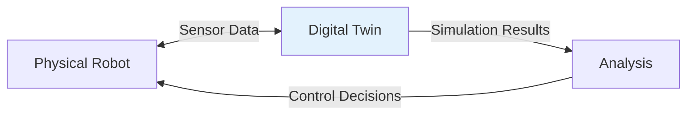

# Chapter 3: Gazebo & Digital Twins

This chapter covers robot simulation using Gazebo, a powerful physics-based simulator for robotics.

## 3.1 What is a Digital Twin?

A **digital twin** is a virtual representation of a physical system that:

- Mirrors the physical system in real-time
- Allows testing without physical hardware
- Enables predictive maintenance
- Supports virtual commissioning



## 3.2 Gazebo Architecture

Gazebo consists of several key components:

| Component | Description |
|-----------|-------------|
| **Physics Engine** | Simulates rigid body dynamics (ODE, Bullet, Simbody) |
| **Rendering Engine** | Generates realistic visuals (OGRE) |
| **Sensor Plugins** | Simulates cameras, LIDAR, IMU, etc. |
| **Robot Models** | URDF/SDF descriptions of robots |
| **World Files** | Define environment, lighting, objects |

## 3.3 SDF (Simulation Description Format)

SDF is Gazebo's native XML format, extending URDF.

```xml
<?xml version='1.0'?>
<sdf version='1.9'>
  <model name='my_robot'>
    <link name='chassis'>
      <pose>0 0 0.5 0 0 0</pose>
      <collision name='collision'>
        <geometry>
          <box>
            <size>0.5 0.3 0.2</size>
          </box>
        </geometry>
      </collision>
      <visual name='visual'>
        <geometry>
          <box>
            <size>0.5 0.3 0.2</size>
          </box>
        </geometry>
      </visual>
    </link>

    <link name='left_wheel'>
      <pose>0.15 0 0.1 0 0 0</pose>
      <collision name='collision'>
        <geometry>
          <cylinder>
            <radius>0.1</radius>
            <length>0.05</length>
          </cylinder>
        </geometry>
      </collision>
      <visual name='visual'>
        <geometry>
          <cylinder>
            <radius>0.1</radius>
            <length>0.05</length>
          </cylinder>
        </geometry>
      </visual>
    </link>

    <joint name='left_wheel_hinge' type='revolute'>
      <parent>chassis</parent>
      <child>left_wheel</child>
      <axis>
        <xyz>0 1 0</xyz>
      </axis>
    </joint>
  </model>
</sdf>
```

## 3.4 Physics Simulation

### Physics Engine Selection

```python
# gazebo.launch.py
from launch import LaunchDescription
from launch_ros.actions import Node

def generate_launch_description():
    return LaunchDescription([
        Node(
            package='gazebo_ros',
            executable='gzserver',
            parameters=[
                {'physics_engine': 'ode'},  # or 'bullet', 'simbody'
                {'max_step_size': 0.001},
                {'real_time_factor': 1.0},
            ],
            arguments=['-s', 'libgazebo_ros_init.so']
        )
    ])
```

### Contact Sensors

```python
# Contact sensor plugin for Gazebo
class ContactSensorPlugin:
    def __init__(self):
        self.contact_points = []

    def OnUpdate(self, info):
        """Called every simulation step."""
        for collision in self.model.contacts:
            for contact in collision.contact:
                self.contact_points.append({
                    'time': info.sim_time,
                    'position': contact.position,
                    'force': contact.wrench.force,
                    'normal': contact.normal
                })
```

## 3.5 Camera Simulation

```xml
<!-- Camera sensor in SDF -->
<sensor name='camera' type='camera'>
  <update_rate>30</update_rate>
  <camera>
    <horizontal_fov>1.047</horizontal_fov>
    <image>
      <width>1920</width>
      <height>1080</height>
      <format>R8G8B8</format>
    </image>
    <clip>
      <near>0.1</near>
      <far>100</far>
    </clip>
  </camera>
  <plugin name='camera_controller' filename='libgazebo_ros_camera.so'>
    <alwaysOn>true</alwaysOn>
    <updateRate>0.0</updateRate>
    <cameraName>robot/camera_image</cameraName>
    <imageTopicName>image_raw</imageTopicName>
    <cameraInfoTopicName>camera_info</cameraInfoTopicName>
  </plugin>
</sensor>
```

## 3.6 LIDAR Simulation

```xml
<!-- LIDAR sensor in SDF -->
<sensor name='laser' type='ray'>
  <pose>0 0 0.1 0 0 0</pose>
  <visualize>true</visualize>
  <update_rate>10</update_rate>
  <ray>
    <scan>
      <horizontal>
        <samples>640</samples>
        <resolution>1</resolution>
        <min_angle>-2.2689</min_angle>
        <max_angle>2.2689</max_angle>
      </horizontal>
    </scan>
    <range>
      <min>0.08</min>
      <max>10.0</max>
      <resolution>0.01</resolution>
    </range>
  </ray>
  <plugin name='laser_controller' filename='libgazebo_ros_ray_sensor.so'>
    <ros>
      <remapping>~/out:=scan</remapping>
    </ros>
  </plugin>
</sensor>
```

## 3.7 World Files

```xml
<?xml version='1.0'?>
<sdf version='1.9'>
  <world name='default'>
    <!-- Physics -->
    <physics type='ode'>
      <max_step_size>0.001</max_step_size>
      <real_time_factor>1.0</real_time_factor>
      <gravity>0 0 -9.8066</gravity>
    </physics>

    <!-- Scene -->
    <scene>
      <ambient>0.4 0.4 0.4 1</ambient>
      <background>0.7 0.7 0.7 1</background>
      <shadows>true</shadows>
    </scene>

    <!-- Sun (light source) -->
    <include>
      <uri>model://sun</uri>
    </include>

    <!-- Ground plane -->
    <include>
      <uri>model://ground_plane</uri>
    </include>

    <!-- Custom objects -->
    <model name='obstacle_1'>
      <static>true</static>
      <pose>2 0 0.5 0 0 0</pose>
      <link name='link'>
        <collision name='collision'>
          <geometry>
            <box><size>1 1 1</size></box>
          </geometry>
        </collision>
        <visual name='visual'>
          <geometry>
            <box><size>1 1 1</size></box>
          </geometry>
          <material>
            <ambient>1 0 0 1</ambient>
          </material>
        </visual>
      </link>
    </model>
  </world>
</sdf>
```

## 3.8 ROS 2 Integration with Gazebo

```python
# spawn_robot.py
import rclpy
from rclpy.node import Node
from gazebo_msgs.srv import SpawnEntity
import os

class RobotSpawner(Node):
    def __init__(self):
        super().__init__('robot_spawner')
        self.spawn_client = self.create_client(SpawnEntity, 'spawn_entity')

    def spawn_robot(self, robot_xml, robot_name='my_robot'):
        while not self.spawn_client.wait_for_service(timeout_sec=1.0):
            self.get_logger().info('Waiting for spawn_entity service...')

        request = SpawnEntity.Request()
        request.name = robot_name
        request.xml = robot_xml
        request.robot_namespace = ''

        future = self.spawn_client.call_async(request)
        rclpy.spin_until_future_complete(self, future)

        if future.result() is not None:
            self.get_logger().info(f'Robot {robot_name} spawned successfully!')
        else:
            self.get_logger().error('Failed to spawn robot')
```

## Summary

In this chapter, you learned:

- **Digital Twins** are virtual copies of physical systems
- **Gazebo** provides physics-based simulation
- **SDF** describes robot models for simulation
- **Physics Engines** simulate rigid body dynamics
- **Sensors** can be simulated with plugins
- **World Files** define simulation environments

## Next Steps

Continue to **[Chapter 4: NVIDIA Isaac](./chapter-04-isaac.md)** to learn about NVIDIA's robotics simulation platform.
