# Chapter 4: NVIDIA Isaac

This chapter covers NVIDIA Isaac, a comprehensive robotics simulation platform leveraging GPU acceleration for physics and rendering.

## 4.1 NVIDIA Isaac Platform

Isaac consists of several components:

| Component | Description |
|-----------|-------------|
| **Isaac Sim** | Physics-based simulator built on NVIDIA Omniverse |
| **Isaac Lab** | Modular framework for robot learning |
| **Isaac ROS** | ROS 2 packages for NVIDIA hardware |
| **Jetson Platform** | Edge computing for robots |

```mermaid
graph TD
    A[NVIDIA Isaac Platform] --> B[Isaac Sim]
    A --> C[Isaac Lab]
    A --> D[Isaac ROS]
    A --> E[Jetson Hardware]

    B --> F[Omniverse]
    B --> G[PhysX]
    B --> H[RTX Renderer]

    C --> I[RL Frameworks]
    C --> J[Robot Learning]

    D --> K[ROS 2 Integration]
    D --> L[Hardware Acceleration]

    style A fill:#76b900
    style F fill:#000000
```



## 4.2 Isaac Sim

Isaac Sim provides:

- **GPU-accelerated physics** via PhysX
- **Photorealistic rendering** with RTX
- **Domain randomization** for sim-to-real transfer
- **Multi-GPU support** for parallel simulation

### Python API

```python
from omni.isaac.kit import SimulationApp

# Initialize Isaac Sim
simulation_app = SimulationApp({"headless": False})

from omni.isaac.core import World
from omni.isaac.core.robots import Robot
from omni.isaac.sensor import Camera
from omni.isaac.core.utils.stage import add_reference_to_stage

# Create world
world = World(stage_units_in_meters=1.0)
world.scene.add_default_ground_plane()

# Add robot
robot_usd_path = "omniverse://localhost/NVIDIA/Assets/Isaac/2023.1.1/Isaac/Robots/Franka/franka.usd"
add_reference_to_stage(usd_path=robot_usd_path, prim_path="/World/Franka")

# Get robot interface
franka = world.scene.add(Robot(prim_path="/World/Franka", name="franka"))

# Add camera
camera = Camera(
    prim_path="/World/Franka/camera",
    position=np.array([0.5, 0.5, 0.5]),
    frequency=20,
    resolution=(224, 224),
    orientation=euler_angles_to_quats(np.array([0, -45, 0]))
)

# Simulation loop
simulation_app.update()
world.step()

while simulation_app.is_running():
    world.step(render=True)
    # Get camera image
    rgb_image = camera.get_rgb()[:, :, :3]
    depth_image = camera.get_depth()

simulation_app.close()
```

## 4.3 Isaac Lab

Isaac Lab provides a modular framework for robot learning:

```python
import omni.isaac.lab as sim
from omni.isaac.lab.envs import ManagerBasedRLEnv
from omni.isaac.lab.utils import configclass

@configclass
class MyEnvCfg:
    """Configuration for my custom environment."""
    env: int = 256  # Number of parallel environments
    episode_length_s: float = 5.0

    # Robot configuration
    robot: sim.assets.ArticulationCfg = FRANKA_PANDA_CFG

    # Physics configuration
    dt: float = 1.0 / 60.0

class MyRobotEnv(ManagerBasedRLEnv):
    """Custom reinforcement learning environment."""

    def __init__(self, cfg: MyEnvCfg, render_mode: str = None):
        super().__init__(cfg, render_mode)

    def _get_observations(self) -> torch.Tensor:
        """Return observations (robot state)."""
        return torch.cat([
            self.robot.data.joint_pos,
            self.robot.data.joint_vel,
        ], dim=-1)

    def _get_rewards(self) -> torch.Tensor:
        """Compute rewards."""
        # Example: reward for reaching target
        tcp_pos = self.robot.data.tcp_pos
        target_pos = self._data["target_pos"]
        distance = torch.norm(tcp_pos - target_pos, dim=-1)
        return -distance  # Negative distance as reward

    def _get_terminated(self) -> torch.Tensor:
        """Check if episode should terminate."""
        # Terminate if close to target
        distance = torch.norm(
            self.robot.data.tcp_pos - self._data["target_pos"],
            dim=-1
        )
        return distance < 0.02
```

## 4.4 GPU-Accelerated Physics

Isaac Sim uses PhysX 5 with GPU acceleration:

```python
from pxr import PhysxSchema

# Configure physics
physics_scene = UsdPhysics.Scene.Define(simulation_app.context, "/physicsScene")
physics_scene.CreateGravityAttr().Set(Gf.Vec3f(0.0, 0.0, -9.81))

# Enable GPU acceleration
physx_scene = PhysxSchema.PhysxScene.Define(
    simulation_app.context,
    "/physicsScene"
)
physx_scene.CreateGpuCollisionFilterPercentageAttr().Set(50)
physx_scene.CreateGpuCollisionStackBufferSizeAttr().Set(16 * 1024 * 1024)
physx_scene.CreateGpuFoundLostAggregatePairsCapacityAttr().Set(1024 * 1024)
physx_scene.CreateGpuFoundLostAggregateCapacityAttr().Set(1024 * 1024)
physx_scene.CreateGpuBounceThresholdFrequencyAttr().Set(1)
physx_scene.CreateGpuTotalAggregatePairsCapacityAttr().Set(16 * 1024 * 1024)
physx_scene.CreateGpuMaxBodyCountAttr().Set(64000)
physx_scene.CreateGpuMaxShapeCountAttr().Set(64000)
```

## 4.5 Domain Randomization

Domain randomization is crucial for sim-to-real transfer:

```python
from omni.isaac.core.utils.stage import add_reference_to_stage
from omni.isaac.core.utils.prims import define_prim
from omni.isaac.nucleus import get_assets_root_path

# Add randomization to scene
import omni.isaac.core.utils.numpy.rotations as rot_utils
import numpy as np

def randomize_lighting():
    """Randomize lighting conditions."""
    from omni.isaac.core.utils.prims import get_prim_at_path
    light_prim = get_prim_at_path("/World/defaultLight")
    light_api = UsdLux.RectLight(light_prim)

    # Random intensity
    intensity = np.random.uniform(100, 10000)
    light_api.CreateIntensityAttr(intensity)

    # Random color
    color = np.random.uniform(0.5, 1.0, 3)
    light_api.CreateColorAttr(Gf.Vec3f(*color))

def randomize_texture():
    """Randomize textures in scene."""
    # Apply random textures to objects
    textures = ["wood", "metal", "plastic", "fabric"]
    for obj_prim in stage.Traverse():
        if obj_prim.IsA(UsdShade.Material):
            texture = np.random.choice(textures)
            # Apply texture...

def randomize_physics():
    """Randomize physics parameters."""
    # Randomize friction, mass, etc.
    pass
```

## 4.6 Isaac ROS

Isaac ROS provides ROS 2 packages for NVIDIA hardware:

```bash
# Install Isaac ROS
sudo apt update
sudo apt install -y ros-humble-isaac-ros-nvblox \
                     ros-humble-isaac-ros-visual-slam \
                     ros-humble-isaac-ros-ess

# Launch visual SLAM
ros2 launch isaac_ros_visual_slam isaac_ros_visual_slam_launch.py
```

### ROS 2 Bridge

```python
# isaac_ros_bridge.py
import rclpy
from rclpy.node import Node
from sensor_msgs.msg import Image
from cv_bridge import CvBridge
import numpy as np

class IsaacROSBridge(Node):
    """Bridge between Isaac Sim and ROS 2."""

    def __init__(self):
        super().__init__('isaac_ros_bridge')
        self.bridge = CvBridge()

        # Publishers
        self.image_pub = self.create_publisher(
            Image,
            '/camera/image_raw',
            10
        )

        # Timer for publishing
        self.timer = self.create_timer(1.0/30.0, self.publish_image)

    def publish_image(self):
        """Get image from Isaac Sim and publish to ROS 2."""
        # Get RGB image from Isaac Sim camera
        rgb_image = self.isaac_camera.get_rgb()[:, :, :3]

        # Convert to ROS 2 message
        ros_image = self.bridge.cv2_to_imgmsg(
            rgb_image.astype(np.uint8),
            encoding='rgb8'
        )
        ros_image.header.stamp = self.get_clock().now().to_msg()

        self.image_pub.publish(ros_image)
```

## 4.7 Free/Cloud Alternatives to Isaac Sim

| Alternative | Description | Free Tier |
|-------------|-------------|-----------|
| **PyBullet** | Open-source physics engine | ✅ Yes |
| **MuJoCo** | Fast physics simulator | ✅ Yes (free for research) |
| **Webots** | Robot simulator | ✅ Yes |
| **CoppeliaSim** | Professional simulator | Limited trial |
| **Gazebo** | Open-source simulator | ✅ Yes |

### PyBullet Example

```python
import pybullet as p
import pybullet_data
import time

# Initialize PyBullet
physicsClient = p.connect(p.GUI)
p.setAdditionalSearchPath(pybullet_data.getDataPath())

# Load plane and robot
p.setGravity(0, 0, -9.81)
planeId = p.loadURDF("plane.urdf")
robotStartPos = [0, 0, 0]
robotStartOrientation = p.getQuaternionFromEuler([0, 0, 0])
robotId = p.loadURDF("franka_panda/panda.urdf", robotStartPos, robotStartOrientation)

# Simulation loop
while True:
    p.stepSimulation()
    time.sleep(1./240.)
```

## Summary

In this chapter, you learned:

- **Isaac Sim** provides GPU-accelerated physics simulation
- **Isaac Lab** is a framework for robot learning
- **Domain Randomization** enables sim-to-real transfer
- **Isaac ROS** bridges Isaac Sim with ROS 2
- **Free alternatives** like PyBullet and MuJoCo exist

## Next Steps

Continue to **[Chapter 5: Vision-Language-Action Models](./chapter-05-vla.md)** to learn about modern AI for robot control.
