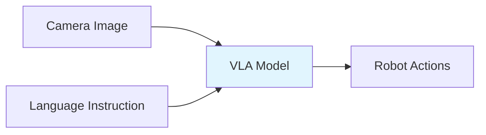

# Chapter 5: Vision-Language-Action Models

This chapter covers Vision-Language-Action (VLA) models, an emerging paradigm for robot control that combines visual perception, language understanding, and action generation.

## 5.1 What are VLA Models?

VLA models take visual and language inputs and directly output robot actions:



Unlike traditional robotics pipelines (perception → planning → control), VLA models are **end-to-end**:

| Traditional Pipeline | VLA Model |
|---------------------|-----------|
| Separate modules | Single unified model |
| Hand-designed features | Learned features |
| brittle to changes | Generalizes better |
| Requires expertise | Can learn from data |

## 5.2 VLA Architecture

```python
# Simplified VLA model architecture
import torch
import torch.nn as nn

class VLAModel(nn.Module):
    """Vision-Language-Action model for robot control."""

    def __init__(self,
                 vision_encoder: nn.Module,
                 language_encoder: nn.Module,
                 action_head: nn.Module,
                 hidden_dim: int = 768):
        super().__init__()
        self.vision_encoder = vision_encoder
        self.language_encoder = language_encoder
        self.action_head = action_head

        # Fusion layer
        self.fusion = nn.Linear(hidden_dim * 2, hidden_dim)
        self.action_dim = 7  # x, y, z, roll, pitch, yaw, gripper

    def forward(self, image, instruction):
        """
        Args:
            image: (B, 3, H, W) camera image
            instruction: (B,) text instruction

        Returns:
            actions: (B, action_dim) robot actions
        """
        # Encode vision
        vision_features = self.vision_encoder(image)  # (B, hidden_dim)

        # Encode language
        language_features = self.language_encoder(instruction)  # (B, hidden_dim)

        # Fuse modalities
        fused = torch.cat([vision_features, language_features], dim=-1)
        fused = self.fusion(fused)  # (B, hidden_dim)

        # Predict actions
        actions = self.action_head(fused)  # (B, action_dim)

        return actions
```

## 5.3 OpenVLA

OpenVLA is an open-source VLA model:

```python
# Using OpenVLA for robot control
from vla import OpenVLA

# Load model
model = OpenVLA.from_pretrained("openvla/openvla-7b")

# Inference
image = load_image("robot_view.jpg")
instruction = "pick up the red block"

actions = model.predict(
    image=image,
    instruction=instruction,
    unnorm_key="franka"  # Robot-specific normalization
)

print(f"Predicted actions: {actions}")
# Example output: {'position': [0.5, 0.2, 0.3], 'gripper': 1.0}
```

## 5.4 Training VLA Models

### Data Collection

VLA models require **multimodal demonstration data**:

```python
# Demonstration data structure
class Demonstration:
    """A single robot demonstration."""

    def __init__(self):
        self.images = []  # List of camera images
        self.instructions = []  # Language instructions
        self.actions = []  # Robot actions (joint positions, end-effector poses)
        self.states = []  # Robot states (joint angles, velocities)
        self.rewards = []  # Optional rewards for RL

# Collect demonstration
demo = Demonstration()
for step in episode:
    demo.images.append(camera.get_image())
    demo.instructions.append(instruction)  # e.g., "pick up the block"
    demo.actions.append(robot.get_action())
    demo.states.append(robot.get_state())
```

### Training Loop

```python
def train_vla(model, dataloader, num_epochs, device):
    """Train VLA model on demonstration data."""

    optimizer = torch.optim.AdamW(model.parameters(), lr=1e-4)
    criterion = nn.MSELoss()  # Action prediction loss

    for epoch in range(num_epochs):
        total_loss = 0
        for batch in dataloader:
            images = batch['images'].to(device)  # (B, T, 3, H, W)
            instructions = batch['instructions']  # List of str
            actions = batch['actions'].to(device)  # (B, T, action_dim)

            # Forward pass
            predicted_actions = model(images, instructions)

            # Compute loss
            loss = criterion(predicted_actions, actions)

            # Backward pass
            optimizer.zero_grad()
            loss.backward()
            optimizer.step()

            total_loss += loss.item()

        avg_loss = total_loss / len(dataloader)
        print(f"Epoch {epoch+1}/{num_epochs}, Loss: {avg_loss:.4f}")
```

## 5.5 Fine-tuning VLA Models

Transfer learning is essential for adapting VLA models:

```python
from transformers import AutoModelForVision2Seq, AutoProcessor

# Load pre-trained VLA model
model = AutoModelForVision2Seq.from_pretrained("openvla/openvla-7b")
processor = AutoProcessor.from_pretrained("openvla/openvla-7b")

# Freeze vision encoder (usually general enough)
for param in.model.vision_encoder.parameters():
    param.requires_grad = False

# Fine-tune on your robot
def fine_tune(model, train_dataloader, val_dataloader):
    optimizer = torch.optim.AdamW(
        filter(lambda p: p.requires_grad, model.parameters()),
        lr=1e-5
    )

    for epoch in range(num_epochs):
        # Training
        model.train()
        for batch in train_dataloader:
            inputs = processor(
                images=batch['images'],
                text=batch['instructions'],
                return_tensors="pt"
            )

            # Add action labels
            labels = batch['actions']

            outputs = model(**inputs, labels=labels)
            loss = outputs.loss

            loss.backward()
            optimizer.step()
            optimizer.zero_grad()

        # Validation
        model.eval()
        with torch.no_grad():
            for batch in val_dataloader:
                # Compute validation metrics
                pass
```

## 5.6 VLA for Different Robot Types

### Manipulation

```python
# Manipulation VLA
class ManipulationVLA(nn.Module):
    """VLA for robotic arm manipulation."""

    def __init__(self):
        super().__init__()
        # Predict end-effector pose (6D) and gripper state (1D)
        self.action_dim = 7

    def forward(self, image, instruction):
        actions = self.model(image, instruction)
        return {
            'position': actions[:, :3],
            'orientation': actions[:, 3:6],
            'gripper': torch.sigmoid(actions[:, 6])
        }
```

### Navigation

```python
# Navigation VLA
class NavigationVLA(nn.Module):
    """VLA for mobile robot navigation."""

    def __init__(self):
        super().__init__()
        # Predict velocity commands
        self.action_dim = 2  # linear, angular velocity

    def forward(self, image, instruction):
        actions = self.model(image, instruction)
        return {
            'linear_velocity': actions[:, 0],
            'angular_velocity': actions[:, 1]
        }
```

## 5.7 Challenges with VLA Models

| Challenge | Solution |
|-----------|----------|
| **Data efficiency** | Pre-training on large datasets, sim-to-real |
| **Generalization** | Domain randomization, multi-task training |
| **Safety** | Constrained decoding, action smoothing |
| **Real-time** | Model distillation, quantization |
| **Sim-to-real gap** | Fine-tuning on real data |

### Action Smoothing

```python
def smooth_actions(predicted_actions, window_size=3):
    """Apply moving average to smooth actions."""
    smoothed = []
    for i in range(len(predicted_actions)):
        start = max(0, i - window_size + 1)
        window = predicted_actions[start:i+1]
        smoothed.append(np.mean(window, axis=0))
    return np.array(smoothed)
```

## 5.8 Free Resources for VLA

| Resource | Description | Link |
|----------|-------------|------|
| **OpenVLA** | Open-source VLA model | github.com/openvla/openvla |
| **BridgeData** | Robot manipulation dataset | rail.berkeley.edu/bridgedata |
| **RT-1** | Robotics Transformer | github.com/google-research/robotics_transformer1 |
| **RT-2** | Robotics Transformer 2 | github.com/google-research/robotics_transformer2 |

## Summary

In this chapter, you learned:

- **VLA Models** combine vision, language, and action in one model
- **End-to-end** learning replaces traditional robotics pipelines
- **OpenVLA** is an open-source implementation
- **Fine-tuning** adapts models to specific robots
- **Challenges** include data efficiency, safety, and generalization

## Next Steps

Continue to **[Chapter 6: Capstone Project](./chapter-06-capstone.md)** to build your own humanoid robot system.
