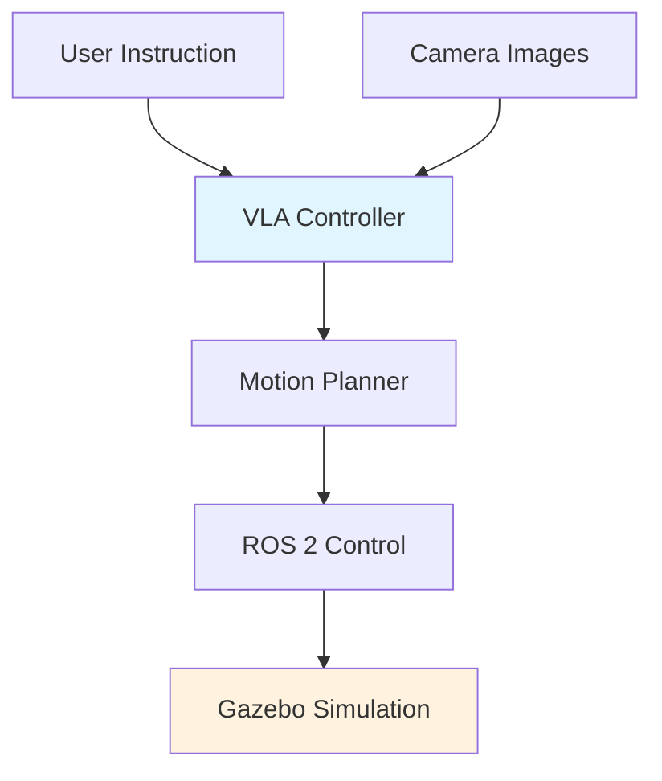
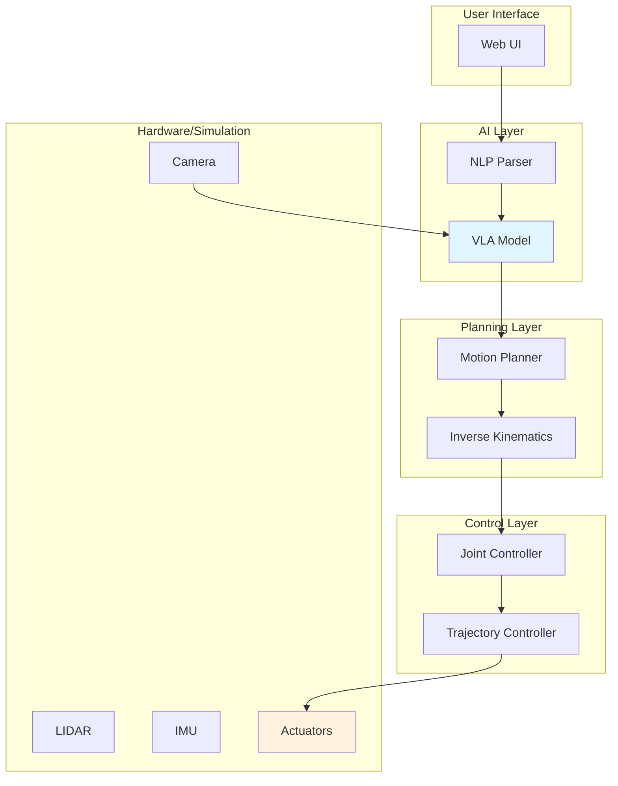

# Chapter 6: Capstone Project

This chapter brings together everything you've learned to design and implement a complete humanoid robot system.

## 6.1 Project Overview

Build a simulated humanoid robot that can:

1. **Navigate** through an environment using vision
2. **Manipulate** objects with its arms
3. **Understand** natural language instructions
4. **Execute** complex tasks using VLA models



## 6.2 System Architecture

### Hardware/Software Stack

| Layer | Component |
|-------|-----------|
| **Hardware** | Simulated Humanoid (Gazebo) |
| **Middleware** | ROS 2 Humble |
| **Control** | Joint trajectory controllers |
| **Planning** | MoveIt 2 for arm motion |
| **Perception** | Camera, LIDAR, IMU |
| **AI** | VLA model for high-level decisions |
| **Interface** | Web-based UI for commands |

## 6.3 Humanoid Robot Model

### URDF Structure

```xml
<?xml version="1.0"?>
<robot name="humanoid">
  <!-- Base/Torso -->
  <link name="torso">
    <visual>
      <geometry>
        <cylinder length="0.6" radius="0.15"/>
      </geometry>
    </visual>
    <inertial>
      <mass value="5.0"/>
      <inertia ixx="0.1" iyy="0.1" izz="0.05" ixy="0" ixz="0" iyz="0"/>
    </inertial>
  </link>

  <!-- Head -->
  <joint name="head_yaw" type="revolute">
    <parent link="torso"/>
    <child link="head_link"/>
    <origin xyz="0 0 0.35"/>
    <axis xyz="0 0 1"/>
    <limit lower="-1.57" upper="1.57" effort="10" velocity="1.0"/>
  </joint>

  <link name="head_link">
    <visual>
      <geometry>
        <sphere radius="0.1"/>
      </geometry>
    </visual>
  </link>

  <!-- Left Arm -->
  <joint name="left_shoulder_pitch" type="revolute">
    <parent link="torso"/>
    <child link="left_upper_arm"/>
    <origin xyz="0 0.2 0.25" rpy="0 0 1.57"/>
    <axis xyz="0 1 0"/>
    <limit lower="-1.57" upper="1.57" effort="20" velocity="2.0"/>
  </joint>

  <!-- Right Arm (mirror of left) -->
  <joint name="right_shoulder_pitch" type="revolute">
    <parent link="torso"/>
    <child link="right_upper_arm"/>
    <origin xyz="0 -0.2 0.25" rpy="0 0 -1.57"/>
    <axis xyz="0 1 0"/>
    <limit lower="-1.57" upper="1.57" effort="20" velocity="2.0"/>
  </joint>

  <!-- Legs -->
  <!-- Similar structure for left and right legs... -->
</robot>
```

## 6.4 ROS 2 Nodes

### System Node Graph

```python
# Main system node
import rclpy
from rclpy.node import Node
from sensor_msgs.msg import Image, JointState
from trajectory_msgs.msg import JointTrajectory
from std_msgs.msg import String

class HumanoidController(Node):
    """Main controller for humanoid robot."""

    def __init__(self):
        super().__init__('humanoid_controller')

        # Subscribers
        self.camera_sub = self.create_subscription(
            Image,
            '/camera/image_raw',
            self.camera_callback,
            10
        )
        self.instruction_sub = self.create_subscription(
            String,
            '/instruction',
            self.instruction_callback,
            10
        )

        # Publishers
        self.joint_cmd_pub = self.create_publisher(
            JointTrajectory,
            '/joint_trajectory_controller/command',
            10
        )

        # State
        self.current_image = None
        self.current_instruction = None

    def camera_callback(self, msg):
        """Handle camera images."""
        self.current_image = msg

    def instruction_callback(self, msg):
        """Handle natural language instructions."""
        self.current_instruction = msg.data
        self.execute_instruction()

    def execute_instruction(self):
        """Execute instruction using VLA model."""
        if self.current_image is None:
            self.get_logger().warn('No image available')
            return

        # Get action from VLA model
        action = self.vla_model.predict(
            image=self.current_image,
            instruction=self.current_instruction
        )

        # Convert action to joint commands
        self.publish_joint_commands(action)

    def publish_joint_commands(self, action):
        """Publish joint trajectory commands."""
        traj = JointTrajectory()
        traj.joint_names = [
            'left_shoulder_pitch', 'left_shoulder_roll',
            'left_elbow', 'right_shoulder_pitch',
            'right_shoulder_roll', 'right_elbow',
            'head_yaw', 'head_pitch'
        ]

        # Create trajectory point
        point = JointTrajectoryPoint()
        point.positions = action['joint_positions']
        point.velocities = [0.0] * len(traj.joint_names)
        point.time_from_start.sec = 1

        traj.points.append(point)
        self.joint_cmd_pub.publish(traj)

def main(args=None):
    rclpy.init(args=args)
    controller = HumanoidController()
    rclpy.spin(controller)
    controller.destroy_node()
    rclpy.shutdown()
```

## 6.5 VLA Integration

```python
# VLA wrapper for ROS 2
import torch
from transformers import AutoModelForVision2Seq, AutoProcessor
from cv_bridge import CvBridge

class VLAWrapper:
    """Wrapper for VLA model in ROS 2."""

    def __init__(self, model_path="openvla/openvla-7b"):
        self.device = "cuda" if torch.cuda.is_available() else "cpu"
        self.model = AutoModelForVision2Seq.from_pretrained(
            model_path,
            trust_remote_code=True
        ).to(self.device)
        self.processor = AutoProcessor.from_pretrained(model_path)
        self.bridge = CvBridge()

    def predict(self, image_msg, instruction):
        """
        Predict actions from image and instruction.

        Args:
            image_msg: ROS 2 Image message
            instruction: Natural language instruction

        Returns:
            Dictionary with joint positions and gripper state
        """
        # Convert ROS image to PIL
        cv_image = self.bridge.imgmsg_to_cv2(image_msg, "rgb8")
        pil_image = Image.fromarray(cv_image)

        # Process inputs
        inputs = self.processor(
            images=pil_image,
            text=instruction,
            return_tensors="pt"
        ).to(self.device)

        # Generate action
        with torch.no_grad():
            outputs = self.model.generate(**inputs)
            action = self.processor.decode(outputs[0])

        return self._parse_action(action)

    def _parse_action(self, action_str):
        """Parse action string into dictionary."""
        # Example: "move_to([0.5, 0.2, 0.3]) gripper(open)"
        import re
        import ast

        # Extract coordinates
        coords = re.findall(r'move_to\((.*?)\)', action_str)
        gripper = 'open' if 'gripper(open)' in action_str else 'close'

        if coords:
            position = ast.literal_eval(coords[0])
        else:
            position = [0, 0, 0]

        return {
            'target_position': position,
            'gripper': gripper
        }
```

## 6.6 Integration with MoveIt 2

```python
# MoveIt 2 integration for arm planning
from moveit_interfaces.msg import MoveItWaypoints
from geometry_msgs.msg import PoseStamped

class MoveItPlanner(Node):
    """Motion planning using MoveIt 2."""

    def __init__(self):
        super().__init__('moveit_planner')
        self.planner_client = self.create_client(
            MoveItWaypoints,
            'plan_waypoints'
        )

    def plan_arm_motion(self, target_pose):
        """Plan motion to target pose."""
        goal = MoveItWaypoints.Goal()
        goal.group_name = "left_arm"

        # Add waypoint
        waypoint = PoseStamped()
        waypoint.header.frame_id = "base_link"
        waypoint.pose.position.x = target_pose[0]
        waypoint.pose.position.y = target_pose[1]
        waypoint.pose.position.z = target_pose[2]
        waypoint.pose.orientation.w = 1.0

        goal.waypoints.append(waypoint)

        # Send goal
        future = self.planner_client.send_goal_async(goal)
        rclpy.spin_until_future_complete(self, future)

        return future.result()
```

## 6.7 Testing in Simulation

### Launch File

```python
# capstone_launch.py
from launch import LaunchDescription
from launch_ros.actions import Node
from launch.actions import ExecuteProcess
import os

def generate_launch_description():
    return LaunchDescription([
        # Gazebo server
        ExecuteProcess(
            cmd=['gzserver', 'empty_world.sdf', '-s'],
            output='screen'
        ),

        # Spawn robot
        Node(
            package='capstone_project',
            executable='spawn_humanoid',
            name='spawn_robot'
        ),

        # VLA controller
        Node(
            package='capstone_project',
            executable='vla_controller',
            name='vla_controller'
        ),

        # Static TF publisher
        Node(
            package='tf2_ros',
            executable='static_transform_publisher',
            arguments=['0', '0', '0', '0', '0', '0', 'base_link', 'world']
        ),
    ])
```

## 6.8 Evaluation Metrics

| Metric | Description | Target |
|--------|-------------|--------|
| **Task Success Rate** | % of tasks completed successfully | > 80% |
| **Execution Time** | Average time per task | < 30 seconds |
| **Collision Rate** | % of executions with collisions | < 5% |
| **Instruction Understanding** | % of correctly parsed instructions | > 90% |

## 6.9 Extensions

### Physical Hardware

To move to real hardware:

1. **Replace Gazebo** with real robot interface
2. **Calibrate sensors** for real-world conditions
3. **Add safety checks** (force limits, emergency stop)
4. **Fine-tune VLA** on real demonstrations

### Multi-Robot Coordination

```python
# Multiple robots working together
class MultiRobotCoordinator(Node):
    """Coordinate multiple humanoid robots."""

    def __init__(self, num_robots=3):
        super().__init__('multi_robot_coordinator')
        self.num_robots = num_robots
        self.robot_positions = {}

        # Subscribe to each robot's state
        for i in range(num_robots):
            self.create_subscription(
                PoseStamped,
                f'/robot_{i}/pose',
                lambda msg, idx=i: self.pose_callback(msg, idx),
                10
            )

    def allocate_tasks(self, tasks):
        """Allocate tasks to robots based on positions."""
        # Simple greedy allocation
        allocations = []
        for task in tasks:
            nearest_robot = self.find_nearest_robot(task.location)
            allocations.append((nearest_robot, task))
        return allocations
```

## Summary

In this capstone project, you:

- **Designed** a complete humanoid robot system
- **Integrated** ROS 2, Gazebo, and VLA models
- **Implemented** natural language control
- **Tested** in simulation before real deployment

## Final Thoughts

You've now learned:

1. **Physical AI Foundations** - Sensors, actuators, state estimation, planning
2. **ROS 2** - Distributed robot software framework
3. **Gazebo** - Physics-based simulation
4. **NVIDIA Isaac** - GPU-accelerated robotics platform
5. **VLA Models** - Vision-language-action for robot control
6. **System Integration** - Building complete robot systems

### Next Steps

- **Build your own robot** using these principles
- **Contribute to open-source** robotics projects
- **Stay updated** with latest research in Physical AI
- **Join the community** of robotics enthusiasts

---

## Appendix: Complete System Diagram



Congratulations on completing the AI-Native Textbook on Physical AI and Humanoid Robotics!
