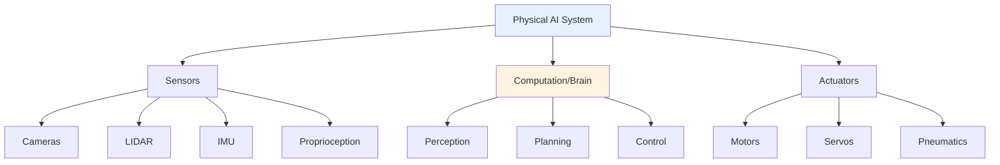

# Physical AI & Humanoid Robotics

Welcome to the AI-Native Textbook Platform for **Physical AI and Humanoid Robotics**.

## What is Physical AI?

Physical AI refers to artificial intelligence systems that interact with the physical world through sensors and actuators. Unlike purely digital AI, physical AI systems must understand and navigate real-world environments.

## What You'll Learn

This textbook covers six key areas:

1. **Physical AI Foundations** - Core concepts, sensors, actuators, and control theory
2. **ROS 2** - Robot Operating System for building complex robotic systems
3. **Gazebo & Digital Twins** - Simulation environments for testing
4. **NVIDIA Isaac** - AI platform for robotics and simulation
5. **Vision-Language-Action Models** - Modern AI for robot control
6. **Capstone Project** - Build your own humanoid robot system

## Who Is This For?

- Robotics engineers looking to understand AI integration
- AI practitioners wanting to apply their skills to physical systems
- Students studying robotics, mechatronics, or AI
- Hobbyists interested in humanoid robots

## Prerequisites

- Basic programming knowledge (Python)
- Understanding of linear algebra and calculus
- Familiarity with Linux command line
- Interest in robotics and AI

## How to Use This Textbook

- **Read sequentially** - Each chapter builds on previous concepts
- **Try the examples** - Code blocks are meant to be run
- **Use the AI Chatbot** - Ask questions when you're confused
- **Track your progress** - Sign in to save bookmarks and track completion

## Language Support

This textbook is available in:
- 🇬🇧 **English**
- 🇵🇰 **Urdu** (اردو)

Use the language dropdown to switch.

---

## Table of Contents

### Chapter 1: Physical AI Foundations
- Sensors and Perception
- Actuators and Control
- State Estimation
- Motion Planning

### Chapter 2: ROS 2
- ROS 2 Architecture
- Nodes and Topics
- Services and Actions
- TF and URDF

### Chapter 3: Gazebo & Digital Twins
- Simulation Basics
- Physics Engines
- Robot Models
- Sensor Plugins

### Chapter 4: NVIDIA Isaac
- Isaac Sim
- Isaac Lab
- NVIDIA Omniverse
- GPU Acceleration

### Chapter 5: Vision-Language-Action Models
- VLA Architecture
- Pre-training and Fine-tuning
- OpenVLA
- Robot Control with VLA

### Chapter 6: Capstone Project
- System Design
- Hardware Selection
- Software Architecture
- Integration and Testing

---

## Get Started

Begin with **[Chapter 1: Physical AI Foundations](./chapter-01-foundations.md)** to learn the fundamental concepts.
