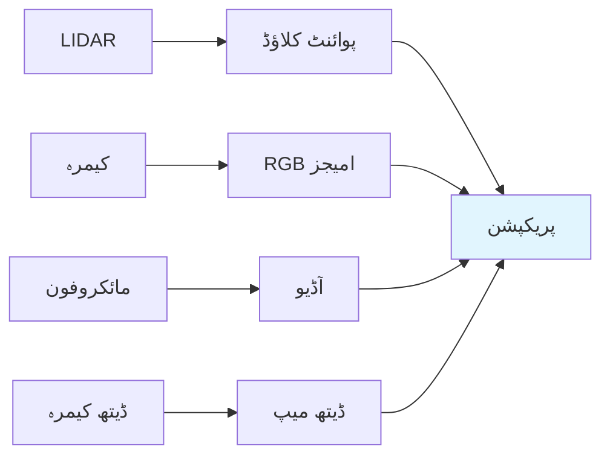

# باب 1: فزیکل AI کی بنیادیں

یہ باب فزیکل AI کے بنیادی تصورات کا تعارف دیتا ہے - مصنوعی ذہانت اور جسمانی روبوٹکس کے درمیان تقاطع۔ آپ سیکھیں گے کہ سنسرز، ایکچویٹرز، اسٹیٹ اسٹیمیشن، اور موشن پلاننگ کیسے کام کرتے ہیں۔

## 1.1 ایمبڈیڈ انٹیلیجنس کیا ہے؟

**ایمبڈیڈ انٹیلیجنس** ان AI نظاموں کو کہتے ہیں جن کا جسمانی جسم ہوتا ہے اور وہ حقیقی دنیا کے ساتھ تعامل کرتے ہیں۔ چیٹ بوٹس یا امیج کلاسفائرز کے برعکس، ایمبڈیڈ AI کو:

- **محسوس کرنا** پڑتا ہے (سنسرز کے ذریعے)
- **خیال کرنا** پڑتا ہے (جسمانی اقدامات اور نتائج کے بارے میں)
- **عمل کرنا** پڑتا ہے (ایکچویٹرز کے ذریعے دنیا میں)
- **سیکھنا** پڑتا ہے (جسمانی تعاملات سے)

### فزیکل AI مشکل کیوں ہے؟

| چیلنج | وضاحت |
|---------|-------------|
| **سنسر کا شور** | حقیقی دنیا کے سنسرز ناقص اور شور والے ہوتے ہیں |
| **جزوی مشاہدہ** | آپ ایک ساتھ سب کچھ نہیں دیکھ سکتے |
| **فزکس的限制ات** | روبوٹس کو فزکس کے قوانین کی پیروی کرنی پڑتی ہے |
| **ریل ٹایم ضروریات** | فیصلے جلدی کرنے پڑتے ہیں |
| **حفاظت** | غلطیاں نقصان یا چوٹ پہنچا سکتی ہیں |

## 1.2 سنسرز اور پریکپشن

سنسرز روبوٹ کی دنیا کو دیکھنے کی کھڑکی ہیں۔ آئیے انسان نما روبوٹکس میں استعمال ہونے والے عام سنسرز کو دیکھیں۔

### ویژن سنسرز

```python
# کیمرا سنسر کنفیگریشن کی مثال
import numpy as np

class CameraSensor:
    def __init__(self, resolution=(1920, 1080), fps=30):
        self.resolution = resolution
        self.fps = fps
        self.fov = 90  # فیلڈ آف ویو ڈگریز میں

    def capture_frame(self):
        """کیمرے سے ایک فریم کیپچر کریں۔"""
        # حقیقی روبوٹ میں، یہ ہاؤئیر کے ساتھ انٹرفیس کرے گا
        frame = np.random.randint(0, 255, (*self.resolution, 3), dtype=np.uint8)
        return frame

    def get_depth_map(self):
        """ڈیتھ معلومات حاصل کریں (اگر ڈیتھ کیمرا دستیاب ہو)۔"""
        # سیمولیٹڈ ڈیتھ میپ
        depth = np.random.random(self.resolution) * 10  میٹر
        return depth
```

### پروپریوسیپٹو سنسرز

یہ سنسرز روبوٹ کو اپنی حالت کے بارے میں بتاتے ہیں:

| سنسر کی قسم | ناپتا ہے | استعمال کی مثال |
|-------------|----------|-------------|
| **IMU** | ایکسلریشن، اینگولر ویلوسٹی | بیلنس، اورینٹیشن |
| **انکوڈرز** | جوائنٹ پوزیشن، ویلوسٹی | دقیق موٹر کنٹرول |
| **فورس سنسرز** | کانٹیکٹ فورس، ٹارک | گراسپنگ، چلنا |
| **کرنٹ سنسرز** | موٹر کرنٹ | رکاوٹ/اسٹال کا پتہ لگانا |

### ایکستیروسیپٹو سنسرز

یہ سنسرز روبوٹ کو بیرونی دنیا کے بارے میں بتاتے ہیں:



## 1.3 ایکچویٹرز اور کنٹرول

ایکچویٹرز روبوٹ کے "پٹھے" ہیں - وہ توانائی کو حرکت میں تبدیل کرتے ہیں۔

### ایکچویٹرز کی اقسام

#### الیکٹرک موٹرز (DC/BLDC)

انسان نما روبوٹس میں سب سے عام کیوں کہ:

- اعلی پاور-ٹو-ویٹ کا تناسب
- دقیق کنٹرول
- صاف آپریشن

```python
class DCMotor:
    def __init__(self, max_torque, max_speed):
        self.max_torque = max_torque  # Nm
        self.max_speed = max_speed    # rad/s
        self.current_torque = 0

    def set_torque(self, torque):
        """موٹر ٹارک سیٹ کریں (زیادہ سے زیادہ تک کلیمپ کریں)۔"""
        self.current_torque = np.clip(torque, -self.max_torque, self.max_torque)

    def get_velocity(self, load):
        """لوڈ دی گئی ویلوسٹی حاصل کریں (سادہ ماڈل)۔"""
        available_torque = self.max_torque - abs(load)
        ratio = self.current_torque / self.max_torque
        return self.max_speed * ratio
```

## 1.4 اسٹیٹ اسٹیمیشن

اسٹیٹ اسٹیمیشن کا مطلب ہے کہ سنسر پیمائشوں سے روبوٹ کی اندرونی حالت کا تعین کرنا۔

### کالمین فلٹر

اسٹیٹ اسٹیمیشن کے لیے بنیادی الگورتھم:

```python
import numpy as np

class KalmanFilter:
    def __init__(self, F, H, Q, R, x0, P0):
        # اسٹیٹ ٹرانزیشن میٹرکس
        self.F = F
        # آبزرویشن میٹرکس
        self.H = H
        # پرویس噪音 کوریانس
        self.Q = Q
        # پیمائش噪音 کوریانس
        self.R = R
        # ابتدائی اسٹیٹ تخمینہ
        self.x = x0
        # ابتدائی کوریانس تخمینہ
        self.P = P0

    def predict(self):
        """اگلا اسٹیٹ پریڈکٹ کریں۔"""
        self.x = self.F @ self.x
        self.P = self.F @ self.P @ self.F.T + self.Q
        return self.x

    def update(self, z):
        """پیمائش z کے ساتھ اپ ڈیٹ کریں۔"""
        # پیمائش رذیدوئل
        y = z - self.H @ self.x
        # رذیدوئل کوریانس
        S = self.H @ self.P @ self.H.T + self.R
        # کالمین گین
        K = self.P @ self.H.T @ np.linalg.inv(S)
        # اسٹیٹ اپ ڈیٹ
        self.x = self.x + K @ y
        # کوریانس اپ ڈیٹ
        I = np.eye(self.P.shape[0])
        self.P = (I - K @ self.H) @ self.P
        return self.x
```

## 1.5 موشن پلاننگ

موشن پلاننگ کا مطلب ہے کہ گول تک پہنچنے کے لیے کارروائیوں کا ایک تسلسل تلاش کرنا۔

### RRT* (Rapidly-exploring Random Tree Star)

```python
import random
import math

class Node:
    def __init__(self, x, y):
        self.x = x
        self.y = y
        self.parent = None
        self.cost = 0

def rrt_star(start, goal, obstacles, max_iter=1000, step_size=1.0):
    """RRT* پاتھ پلاننگ الگورتھم۔"""
    nodes = [Node(*start)]

    for i in range(max_iter):
        # 1. رینڈم پوائنٹ سیمپل کریں
        if random.random() < 0.1:  # 10% چانس گول سیمپل کرنے کا
            x_rand = goal
        else:
            x_rand = (random.uniform(-10, 10), random.uniform(-10, 10))

        # 2. نیAREST نوڈ تلاش کریں
        x_nearest = min(nodes, key=lambda n: distance(n, Node(*x_rand)))

        # 3. رینڈم پوائنٹ کی طرف steerk کریں
        theta = math.atan2(x_rand[1] - x_nearest.y, x_rand[0] - x_nearest.x)
        x_new = (
            x_nearest.x + step_size * math.cos(theta),
            x_nearest.y + step_size * math.sin(theta)
        )

        # 4. کولژن چیک کریں
        if collides(x_nearest, Node(*x_new), obstacles):
            continue

        x_new_node = Node(*x_new)

        # 5. بہترین پیرنٹ تلاش کریں (RRT* بہتری)
        near_nodes = [n for n in nodes if distance(n, x_new_node) < step_size * 2]
        if near_nodes:
            x_min = min(near_nodes, key=lambda n: n.cost + distance(n, x_new_node))
            x_new_node.parent = x_min
            x_new_node.cost = x_min.cost + distance(x_min, x_new_node)

        nodes.append(x_new_node)

        # چیک کریں کہ گول پہنچ گیا
        if distance(x_new_node, Node(*goal)) < step_size:
            return extract_path(x_new_node)

    return None  # کوئی پاتھ نہیں ملا
```

## خلاصہ

اس باب میں، آپ نے سیکھا:

- **فزیکل AI** پریکپشن، ریزننگ، اور ایکشن کو جسمانی دنیا میں ملا دیتا ہے
- **سنسرز** شور والے، جزوی مشاہدات فراہم کرتے ہیں
- **ایکچویٹرز** موٹرز، ہائیڈرولکس، یا نیومٹکس کے ذریعے توانائی کو حرکت میں تبدیل کرتے ہیں
- **PID کنٹرول** روبوٹ کنٹرول کی بنیاد ہے
- **کالمین فلٹرز** شور والی پیمائشوں سے اسٹیٹ کا تخمینہ لگاتے ہیں
- **موشن پلاننگ** کنفیگریشن اسپیس کے ذریعے válido پاتھ تلاش کرتا ہے

## اگلا قدم

**[باب 2: ROS 2](./chapter-02-ros2.md)** پر جاری رکھیں تاکہ سیکھ سکیں کہ پیچیدہ روبوٹک سسٹمز روبوٹ آپریٹنگ سسٹم کا استعمال کر کیسے بنائے جاتے ہیں۔
