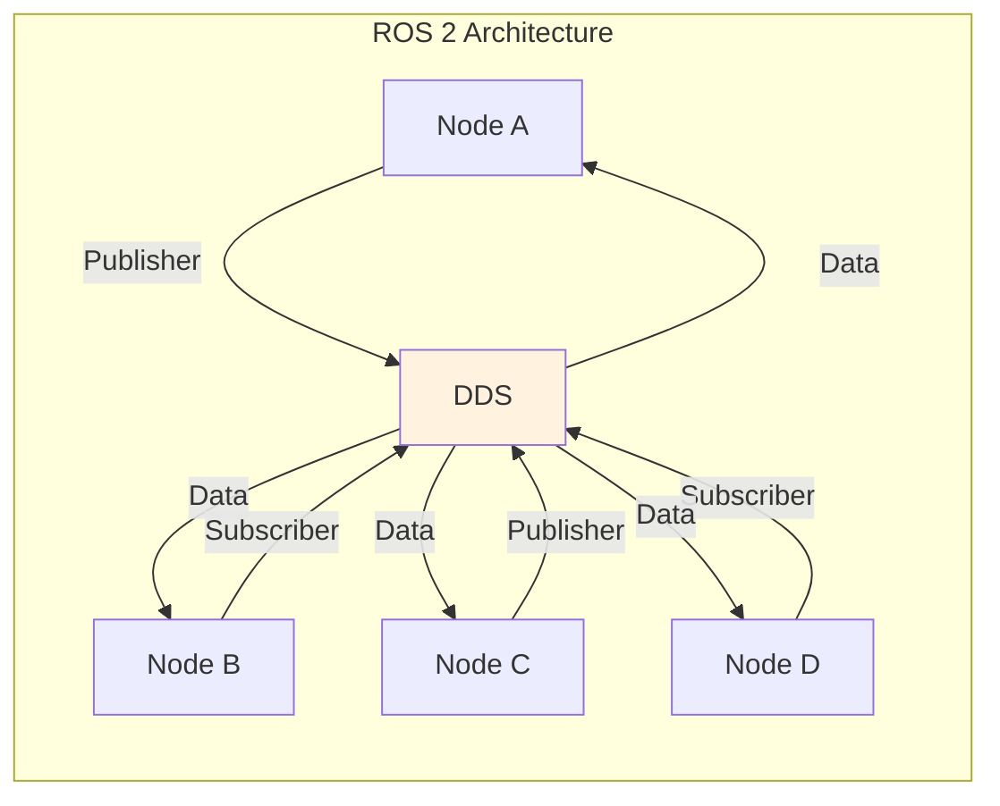

# باب 2: ROS 2 - روبوٹ آپریٹنگ سسٹم

یہ باب ROS 2 (روبوٹ آپریٹنگ سسٹم 2) کے بارے میں ہے، جو کہ پیچیدہ روبوٹ ایپلی کیشنز بنانے کے لیے ایک مڈلویئر فریم ورک ہے۔

## 2.1 ROS 2 کیا ہے؟

ROS 2 سافٹ ویئر لائبریریوں اور ٹولز کا ایک سیٹ ہے جو روبوٹ ایپلی کیشنز بنانے کے لیے استعمال ہوتا ہے۔



## 2.2 ROS 2 کور کنسیپٹس

### نوڈز

نوڈز ایسے پروسیس ہیں جو حساب کرتے ہیں۔ ROS 2 نوڈز کا ایک distributeڈ سسٹم ہے۔

```python
# my_first_node.py
import rclpy
from rclpy.node import Node

class MyFirstNode(Node):
    def __init__(self):
        super().__init__('my_first_node')
        self.get_logger().info('Hello, ROS 2!')

def main(args=None):
    rclpy.init(args=args)
    node = MyFirstNode()
    rclpy.spin(node)
    node.destroy_node()
    rclpy.shutdown()

if __name__ == '__main__':
    main()
```

### ٹاپکس

ٹاپکس نام والے بس ہیں جن پر نوڈز میسجز کا تبادلہ کرتے ہیں۔

**پبلیشرز** میسجات بھیجتے ہیں، **سبسکرائبرز** میسجات وصول کرتے ہیں۔

## 2.3 سروسز

سروسز ریکویسٹ/ریسپونس مواصلات کے لیے ہیں، جیسے فنکشن کال۔

## 2.4 TF (ٹرانسفرم لائبریری)

TF کوآرڈینیٹ فریمز کے درمیان تعلق کو وقت کے ساتھ برقرار رکھتا ہے۔

## 2.5 URDF (یونیفائڈ روبوٹ تفصیل فارمیٹ)

URDF روبوٹ کی جیومیٹری کو بیان کرنے کے لیے XML فارمیٹ ہے۔

## خلاصہ

اس باب میں، آپ نے سیکھا:

- **ROS 2** ایک distributeڈ روبوٹ سافٹ ویئر فریم ورک ہے
- **نوڈز** پروسیس ہیں جو آپس میں بات کرتی ہیں
- **ٹاپکس** pub/sub میسجنگ کو قابل بناتے ہیں
- **سروسز** ریکویسٹ/ریسپونس فراہم کرتے ہیں
- **ایکشنز** لمبے چلنے والے ٹاسکس کو ہینڈل کرتے ہیں
- **TF** کوآرڈینیٹ ٹرانسفرمز کو منیج کرتا ہے
- **URDF** روبوٹ جیومیٹری کو بیان کرتا ہے

## اگلا قدم

**[باب 3: گیزیبو اور ڈیجیٹل ٹوئنز](./chapter-03-gazebo.md)** پر جاری رکھیں تاکہ روبوٹ سیمولیشن کے بارے میں سیکھیں۔
