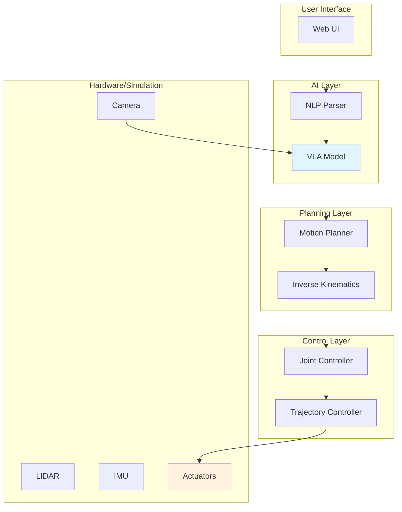

# باب 6: کیپ اسٹون پروجیکٹ

یہ باب آپ نے جو سیکھا ہے اسے ایک مکمل انسان نما روبوٹ سسٹم ڈیزائن اورimplement کرنے کے لیے لاتا ہے۔

## 6.1 پروجیکٹ کا جائزہ

ایک سیمولیٹڈ انسان نما روبوٹ بنائیں جو:
1. **نیویگیٹ** کرسکے vision کا استعمال کر کے
2. **منپولیٹ** کر سکے objects کو اپنے ہاتھوں سے
3. **سمجھ** سکے natural language instructions
4. **Execute** کر سکے complex tasks VLA ماڈلز کا استعمال کر کے

## 6.2 سسٹم آرکائیکچر

### ہاؤئیر/سافٹ ویئر اسٹیک

| لیئر | جزو |
|-------|-----------|
| **ہاؤئیر** | سیمولیٹڈ انسان نما (گیزیبو) |
| **مڈلویئر** | ROS 2 ہیبل |
| **کنٹرول** | جوائنٹ ٹراجیکٹری کنٹرولرز |
| **پلاننگ** | MoveIt 2 آرم موشن کے لیے |
| **پریکپشن** | کیمرہ، LIDAR، IMU |
| **AI** | high-level فیصلوں کے لیے VLA ماڈل |
| **انٹرفیس** | کمانڈز کے لیے ویب پر مبنی UI |

## 6.3 انسان نما روبوٹ ماڈل

## 6.4 ROS 2 نوڈز

## 6.5 VLA انضمام

## 6.6 MoveIt 2 کے ساتھ انضمام

## 6.7 سیمولیشن میں ٹیسٹنگ

## 6.8评估 میٹرکس

| میٹرک | وضاحت | ٹارگٹ |
|--------|-------------|--------|
| **ٹاسک کامیابی کی شرح** | کامیاب سے مکمل ہونے والے ٹاسکس کا فیصد | > 80% |
| **Execuشن ٹائم** | فی ٹاسک اوسطاً وقت | < 30 سیکنڈ |
| **کولژن ریٹ** | کولژن کے ساتھ executions کا فیصد | < 5% |
| **Instruction سمجھ** | صحیح طور پر parse ہونے والے instructions کا فیصد | > 90% |

## 6.9 توسیعات

### جسمانی ہاؤئیر

حقیقی ہاؤئیر پر جانے کے لیے:
1. **گیزیبو کو تبدیل کریں** حقیقی روبوٹ انٹرفیس کے ساتھ
2. **سنسرز کیلیبریٹ کریں** حقیقی دنیا کی حالتوں کے لیے
3. **سیفٹی چیکس شامل کریں** (force limits، ایمرجنسی اسٹاپ)
4. **حقیقی demonstrations پر VLA fine-tune کریں**

### Multi-Robot coordinationsn

## خلاصہ

اس کیپ اسٹون پروجیکٹ میں، آپ نے:

- **ڈیزائن** ایک مکمل انسان نما روبوٹ سسٹم
- **مکمل** ROS 2، گیزیبو، اور VLA ماڈلز
- **implement** natural language کنٹرول
- **ٹیسٹڈ** سیمولیشن میں حقیقی ڈپلائمنٹ سے پہلے

## اختتامی خیالات

آپ نے اب سیکھا:

1. **فزیکل AI کی بنیادیں** - سنسرز، ایکچویٹرز، اسٹیٹ اسٹیمیشن، پلاننگ
2. **ROS 2** - distributeڈ روبوٹ سافٹ ویئر فریم ورک
3. **گیزیبو** - فزکس پر مبنی سیمولیشن
4. **این وڈیا آیزک** - GPU-ایکسیلریٹڈ روبوٹکس پلیٹ فارم
5. **VLA ماڈلز** - روبوٹ کنٹرول کے لیے ویژن-لینگویج-ایکشن
6. **سسٹم انضمام** - مکمل روبوٹ سسٹمز بنانا

### اگلے اقدامات

- **اپنا روبوٹ بنائیں** ان اصولوں کا استعمال کر کے
- **اوپن سورس میں حصہ لیں** روبوٹکس پروجیکٹس کے
- **اپ ڈیٹڈ** رہیں فزیکل AI میں جدید تحقیق سے
- **کمیونٹی میں شامل ہوں** روبوٹکس شوقین افراد کی

---

## آپ کی کامپلیٹیشن پر مبارک باد!

AI-مصندو نصابی کتاب فزیکل AI اور انسان نما روبوٹکس پر مکمل کرنے پر مبارک باد! 🎉

---

## منسلکہ: مکمل سسٹم ڈایاگرام

