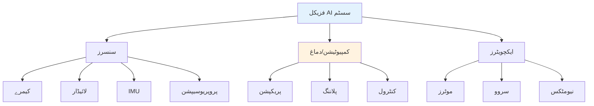

# فزیکل AI اور انسان نما روبوٹکس

AI-مصندو نصابی پلیٹ فارم میں خوش آمدید **فزیکل AI اور انسان نما روبوٹکس** کے لیے۔

## فزیکل AI کیا ہے؟

فزیکل AI مصنوعی ذہانت کے ان نظاموں کو کہتے ہیں جو سنسروں اور ایکچویٹرز کے ذریعے جسمانی دنیا کے ساتھ تعامل کرتے ہیں۔ خالص ڈیجیٹل AI کے برعکس، فزیکل AI نظاموں کو جسمانی ماحول کو سمجھنا اور اس میں نیویگیٹ کرنا پڑتا ہے۔

## آپ کیا سیکھیں گے

یہ نصابی کتاب چھ اہم علاقوں کو کاور کرتی ہے:

1. **فزیکل AI کی بنیادیں** - بنیادی تصورات، سنسرز، ایکچویٹرز، اور کنٹرول تھیوری
2. **ROS 2** - پیچیدہ روبوٹک سسٹمز بنانے کے لیے روبوٹ آپریٹنگ سسٹم
3. **گیزیبو اور ڈیجیٹل ٹوئنز** ٹیسٹنگ کے لیے سیمولیشن ماحول
4. **این وڈیا آیزک** روبوٹکس اور سیمولیشن کے لیے AI پلیٹ فارم
5. **ویژن-لینگویج-ایکشن ماڈلز** روبوٹ کنٹرول کے لیے جدید AI
6. **کیپ اسٹون پروجیکٹ** اپنا انسان نما روبوٹ سسٹم بنائیں

## یہ کتاب کس کے لیے ہے؟

- روبوٹکس انجینئرز جو AI انضمام سمجھنا چاہتے ہیں
- AI پریکٹیشنرز جو اپنی ہنر جسمانی نظاموں پر لاگانا چاہتے ہیں
- طلباء جو روبوٹکس، میکٹرونکس، یا AI کی تعلیم حاصل کر رہے ہیں
- شوقین افراد جن کی دلچسپی انسان نما روبوٹس میں ہے

## شروط

- بنیادی پروگرامنگ کا علم (پایتھون)
- لینیئر الجبرا اور کیلکولس کی سمجھ
- لینکس کمانڈ لائن سے واقفیت
- روبوٹکس اور AI میں دلچسپی

## یہ نصابی کتاب کیسے استعمال کریں

- **ترتیب سے پڑھیں** - ہر باب پچھلے تصورات پر بنایا جاتا ہے
- **مثالوں کو آزمائیں** - کوڈ بلاکس چلانے کے لیے بنائے گئے ہیں
- **AI چیٹ بوٹ استعمال کریں** - جب آپ پریشان ہیں تو سوال پوچھیں
- **پیش رفت ٹریک کریں** - بک مارکس محفوظ کرنے اور مکمل کرنے کے لیے سائن ان کریں

## زبان کی سپورٹ

یہ نصابی کتاب میں دستیاب ہے:
- 🇬🇧 **انگلش**
- 🇵🇰 **اردو**

زبان ڈراپ ڈاؤن استعمال کرنے کے لیے سوئچ کریں۔

---

## کاٹ لوگ آف کانٹینٹس

### باب 1: فزیکل AI کی بنیادیں
- سنسرز اور پریکپشن
- ایکچویٹرز اور کنٹرول
- اسٹیٹ اسٹیمیشن
- موشن پلاننگ

### باب 2: ROS 2
- ROS 2 آرکائیکچر
- نوڈز اور ٹاپکس
- سروسز اور ایکشنز
- TF اور URDF

### باب 3: گیزیبو اور ڈیجیٹل ٹوئنز
- سیمولیشن کی بنیادیں
- فزکس انجنز
- روبوٹ ماڈلز
- سنسر پلگ انز

### باب 4: این وڈیا آیزک
- آیزک سیم
- آیزک لیب
- این وڈیا اومنیورس
- GPUs ایکسیلریشن

### باب 5: ویژن-لینگویج-ایکشن ماڈلز
- VLA آرکائیکچر
- پری-ٹریننگ اور فائن ٹیوننگ
- اوپن VLA
- VLA کے ساتھ روبوٹ کنٹرول

### باب 6: کیپ اسٹون پروجیکٹ
- سسٹم ڈیزائن
- ہاؤئیر کا انتخاب
- سافٹ ویئر آرکائیکچر
- انضمام اور ٹیسٹنگ

---

## شروع کریں

**[باب 1: فزیکل AI کی بنیادیں](./chapter-01-foundations.md)** سے شروع کریں تاکہ بنیادی تصورات سیکھ سکیں۔
